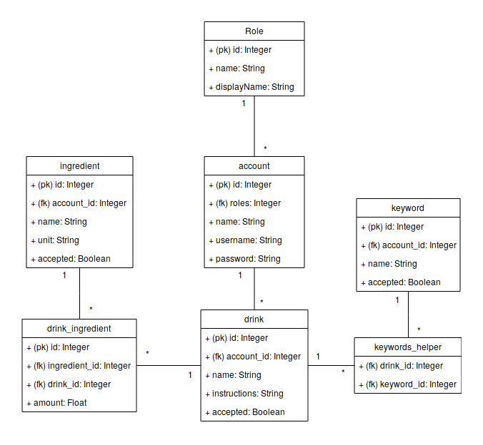

# Drinkkiarkiston tietokanta

## Tietokantakaavio


## CREATE TABLE -lauseet

```
CREATE TABLE account (
    id INTEGER NOT NULL,
    date_created DATETIME,
    date_modified DATETIME,
    name VARCHAR ( 144 ) NOT NULL,
    username VARCHAR ( 144 ) NOT NULL,
    password VARCHAR ( 144 ) NOT NULL,
    roles VARCHAR ( 100 ),
    PRIMARY KEY(id),
    FOREIGN KEY(roles) REFERENCES role (id),
);

CREATE TABLE drink (
    id INTEGER NOT NULL,
    date_created DATETIME,
    date_modified DATETIME,
    name VARCHAR ( 144 ) NOT NULL,
    instructions VARCHAR ( 200 ),
    account_id INTEGER,
    accepted boolean DEFAULT 0,
    PRIMARY KEY(id),
    FOREIGN KEY(account_id) REFERENCES account (id),
);

CREATE TABLE ingredient (
    id INTEGER NOT NULL,
    date_created DATETIME,
    date_modified DATETIME,
    name VARCHAR ( 144 ) NOT NULL,
    unit VARCHAR ( 10 ) NOT NULL,
    accepted boolean DEFAULT 0,
    account_id INTEGER,
    PRIMARY KEY(id),
    FOREIGN KEY(account_id) REFERENCES account (id),
);

CREATE TABLE keyword (
    id INTEGER NOT NULL,
    date_created DATETIME,
    date_modified DATETIME,
    name VARCHAR ( 144 ) NOT NULL,
    accepted boolean DEFAULT 0,
    account_id INTEGER,
    PRIMARY KEY(id),
    FOREIGN KEY(account_id) REFERENCES account (id),
);

CREATE TABLE role (
    id INTEGER NOT NULL,
    date_created DATETIME,
    date_modified DATETIME,
    name VARCHAR(100),
    displayName VARCHAR(100),
    PRIMARY KEY (id)
)

CREATE TABLE drink_ingredient (
    date_created DATETIME,
    date_modified DATETIME,
    id INTEGER NOT NULL,
    amount INTEGER,
    drink_id INTEGER,
    ingredient_id INTEGER,
    PRIMARY KEY (id),
    FOREIGN KEY(drink_id) REFERENCES drink (id),
    FOREIGN KEY(ingredient_id) REFERENCES ingredient (id)
);

CREATE TABLE keywords_helper (
    keyword_id INTEGER NOT NULL,
    drink_id INTEGER NOT NULL,
    PRIMARY KEY (keyword_id, drink_id),
    FOREIGN KEY(keyword_id) REFERENCES keyword (id),
    FOREIGN KEY(drink_id) REFERENCES drink (id)
);
```
